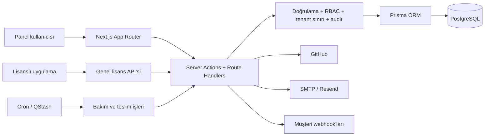

<div align="center">

# Ops Center

**Müşteri, proje, lisans, altyapı ve finans operasyonları için çok kiracılı yönetim merkezi.**

Türkçe arayüzlü, self-host edilebilir ve tip güvenli bir SaaS operasyon paneli.

[](https://nextjs.org/)
[](https://www.typescriptlang.org/)
[](https://www.postgresql.org/)
[](https://github.com/tbsagdic/ops-center/commits)
[](https://github.com/tbsagdic/ops-center/issues)

[Özellikler](#özellikler) · [Hızlı başlangıç](#hızlı-başlangıç) · [Yapılandırma](#yapılandırma) · [Lisans API'si](#genel-lisans-apisi) · [Katkı](#katkıda-bulunma)

</div>

## Ops Center nedir?

Ops Center; yazılım ajanslarının, ürün ekiplerinin ve SaaS işletmelerinin günlük
operasyonlarını tek bir çalışma alanında toplar. Müşteri ve proje takibinden lisans
yaşam döngüsüne, sunucu ve domain envanterinden faturalandırmaya kadar birbirine bağlı
süreçleri aynı panel üzerinden yönetmeyi amaçlar.

Uygulama Next.js App Router, React Server Components ve Server Actions üzerine
kuruludur. PostgreSQL verileri Prisma ile yönetilir; çalışma alanı izolasyonu, rol
tabanlı erişim denetimi ve denetim izi uygulamanın çekirdek katmanlarında uygulanır.

## Özellikler

| Alan | Yetenekler |
|---|---|
| **Müşteri yönetimi** | Müşteri ve şube kayıtları, durum takibi, proje ve finans ilişkileri |
| **Proje ve ürün kataloğu** | Proje yaşam döngüsü, sorumlu atama, bütçe, teknoloji yığını ve tekrar kullanılabilir ürün kayıtları |
| **Lisans yönetimi** | Güvenli anahtar üretimi, domain/ortam eşleştirme, aktivasyon limiti, çevrimdışı tolerans ve webhook olayları |
| **Sunucu envanteri** | Sunucu özellikleri, erişim bilgileri, yenileme tarihleri, maliyetler ve proje bağlantıları |
| **Domain takibi** | Kayıt kuruluşu, yenileme, SSL bitiş tarihi, maliyet ve lisans domainleriyle eşleştirme |
| **Finans** | Tekrarlayan faturalandırma planları, faturalar, ödemeler, döviz dönüşümü ve PDF çıktısı |
| **Ekip ve güvenlik** | Auth.js oturumları, 2FA, RBAC, giriş kilidi, kiracı izolasyonu ve audit log |
| **GitHub entegrasyonu** | OAuth veya PAT bağlantısı, hızlı repo seçimi ve canlı repo istatistikleri |
| **Otomasyon** | Vercel Cron, isteğe bağlı QStash kuyruğu, Redis tabanlı oran sınırlama ve webhook outbox |

## Mimari



### Temel güvenlik sınırları

- **Kiracı izolasyonu:** [`getTenantDb()`](src/lib/db/tenant.ts), Prisma `$extends`
  üzerinden okumalara `workspace_id` ve `deleted_at` filtrelerini ekler; yazmalarda
  çalışma alanı kimliğini zorlar.
- **Yetkilendirme:** [`requirePermission()`](src/lib/auth/permissions.ts), korunan
  Server Action girişlerinde izni doğrular ve yetkisiz denemeleri güvenlik günlüğüne yazar.
- **Denetim izi:** [`writeAudit()`](src/lib/audit.ts), hassas alanları `[REDACTED]`
  olarak maskeleyerek kritik değişiklikleri kaydeder.
- **Lisans kriptografisi:** Lisans anahtarları HMAC-SHA256 özetiyle aranır. Düz anahtarlar,
  webhook sırları ve GitHub token'ları AES-256-GCM ile şifrelenmiş olarak saklanır.
- **Dış istek güvenliği:** Webhook ve benzeri sunucu tarafı HTTP isteklerinde SSRF
  kontrolleri uygulanır.

## Teknoloji yığını

| Katman | Teknoloji |
|---|---|
| Framework | Next.js 16, React 19, React Server Components, Server Actions |
| Dil | TypeScript 5, strict mode |
| Veritabanı | PostgreSQL, Prisma 7, `@prisma/adapter-pg` |
| Kimlik doğrulama | Auth.js v5, credentials provider, veritabanı oturumu |
| Arayüz | Tailwind CSS 4, shadcn/ui, Radix UI, Lucide |
| Doğrulama | Zod 4, istemci ve sunucu tarafı çift doğrulama |
| Kuyruk / cache | İsteğe bağlı Upstash QStash, Redis ve Ratelimit |
| E-posta | Nodemailer üzerinden SMTP veya Resend |
| PDF | pdf-lib, gömülü Noto Sans fontları |

## Hızlı başlangıç

### Gereksinimler

- Node.js **20.9** veya üzeri
- npm
- PostgreSQL erişimi
- Git

### 1. Depoyu klonlayın

```bash
git clone https://github.com/tbsagdic/ops-center.git
cd ops-center
npm ci
```

### 2. Ortam dosyasını hazırlayın

```bash
cp .env.example .env
```

PowerShell kullanıyorsanız:

```powershell
Copy-Item .env.example .env
```

`.env` içindeki zorunlu değerleri doldurduktan sonra yapılandırmayı doğrulayın:

```bash
npm run env:check
```

Anahtar üretmek için:

```bash
# NEXTAUTH_SECRET / APP_PEPPER / CRON_SECRET
node -e "console.log(require('crypto').randomBytes(32).toString('base64url'))"

# ENCRYPTION_KEY — 64 hex karakter
node -e "console.log(require('crypto').randomBytes(32).toString('hex'))"

# NEXT_SERVER_ACTIONS_ENCRYPTION_KEY — 32 bayt base64
node -e "console.log(require('crypto').randomBytes(32).toString('base64'))"
```

### 3. Veritabanını hazırlayın

```bash
npm run db:migrate
npm run db:seed
```

Seed işlemi için `SEED_OWNER_EMAIL` ve `SEED_OWNER_PASSWORD` değerleri zorunludur.
Parola en az 16 karakter olmalı; büyük/küçük harf, sayı ve sembol içermelidir.
Parola loglanmaz ve ilk girişte değiştirilmesi zorunlu tutulur.

### 4. Uygulamayı çalıştırın

```bash
npm run dev
```

Uygulama varsayılan olarak [http://localhost:3000](http://localhost:3000) adresinde
açılır ve giriş sayfasına yönlendirir.

## Yapılandırma

Tüm seçenekler ve açıklamaları [`.env.example`](.env.example) dosyasında bulunur.

### Temel değişkenler

| Değişken | Açıklama |
|---|---|
| `DATABASE_URL` | Uygulama çalışma zamanı için PostgreSQL bağlantısı |
| `DIRECT_URL` | Migration ve seed için doğrudan PostgreSQL bağlantısı; özellikle pooler kullanılan kurulumlarda önerilir |
| `NEXTAUTH_URL` | Auth.js taban URL'si |
| `NEXTAUTH_SECRET` | Oturum imzalama sırrı, en az 32 karakter |
| `APP_PEPPER` | Lisans anahtarı HMAC pepper değeri, en az 32 karakter |
| `ENCRYPTION_KEY` | AES-256-GCM için 64 karakterlik hex anahtar |
| `SEED_OWNER_EMAIL` | İlk owner hesabının e-posta adresi; yalnız seed sırasında kullanılır |
| `SEED_OWNER_PASSWORD` | İlk owner hesabının tek kullanımlık güçlü parolası |

### Üretim değişkenleri

Üretimde HTTPS kullanan `APP_URL` / `NEXTAUTH_URL` ile birlikte `CRON_SECRET` ve
`NEXT_SERVER_ACTIONS_ENCRYPTION_KEY` zorunludur.

| Entegrasyon | Değişkenler | Durum |
|---|---|---|
| Redis | `UPSTASH_REDIS_REST_URL`, `UPSTASH_REDIS_REST_TOKEN` | İsteğe bağlı; yoksa sayaçlar süreç belleğinde tutulur |
| QStash | `QSTASH_TOKEN`, `QSTASH_CURRENT_SIGNING_KEY`, `QSTASH_NEXT_SIGNING_KEY` | İsteğe bağlı; tanımlanırsa üçü birlikte gerekir |
| E-posta | `EMAIL_DRIVER`, `EMAIL_FROM` ve SMTP veya Resend değerleri | İsteğe bağlı; yoksa 2FA e-postası ve ekip daveti gönderilemez |
| GitHub OAuth | `GITHUB_CLIENT_ID`, `GITHUB_CLIENT_SECRET` | İsteğe bağlı; PAT bağlantısı OAuth olmadan da çalışır |
| Kaynak repo | `APP_GITHUB_REPOSITORY`, `APP_GITHUB_TOKEN` | Build metadata'sı yoksa repo tespiti ve özel repo erişimi için |

> [!IMPORTANT]
> Çok instance'lı dağıtımlarda Redis kullanılmazsa oran sınırları her instance için
> ayrı tutulur. Yarım Redis veya QStash yapılandırması ortam denetiminden geçmez.

## GitHub entegrasyonu

Her çalışma alanı için tek GitHub bağlantısı saklanır. Token yalnızca sunucu tarafında
çözülür ve hiçbir zaman istemciye gönderilmez. Bağlantıyı sadece `system.manage`
iznine sahip owner kurabilir veya kaldırabilir.

### Bağlanma seçenekleri

1. **OAuth App:** `GITHUB_CLIENT_ID` ve `GITHUB_CLIENT_SECRET` tanımlandığında
   **Ayarlar → GitHub Bağlantısı** altında OAuth akışı kullanılabilir. Callback adresi
   `<APP_URL>/api/github/callback` olmalıdır.
2. **Personal Access Token:** Ek uygulama kurulumu gerektirmez. Özel depolar için
   `repo`, organizasyon bilgileri için `read:org` kapsamı gerekir.

Proje formundaki aranabilir repo seçici; repo URL'si, proje adı, varsayılan dal,
açıklama ve dil alanlarını doldurur. Repo istatistikleri kalıcı olarak tutulmaz;
GitHub'dan kısa ömürlü, tenant'a özel bir cache üzerinden okunur.

`/sistem-guncelleme`, kaynak deponun commit sayısını `package.json` sürüm serisiyle
birleştirerek kurulumlar arasında tutarlı bir uygulama sürümü gösterir. Build ortamı
depoyu belirleyemiyorsa şu değer kullanılabilir:

```dotenv
APP_GITHUB_REPOSITORY="tbsagdic/ops-center"
```

## Genel lisans API'si

Ops Center, lisanslanan uygulamaların sunucu tarafından çağırabileceği bir doğrulama
ve aktivasyon bırakma API'si sunar.

### Lisans doğrulama

```http
POST /api/v1/licenses/validate
Content-Type: application/json
```

```json
{
  "license_key": "PT-XXXXX-XXXXX-XXXXX-XXXXX",
  "domain": "musteri.com",
  "environment": "production",
  "instance_id": "sunucuya-ozel-sabit-id",
  "app_version": "1.0.0"
}
```

İlk başarılı doğrulama bir `activation_token` döndürür. Bu token yalnızca müşteri
uygulamasının sunucu tarafında saklanmalı ve sonraki isteklere eklenmelidir:

```json
{
  "license_key": "PT-XXXXX-XXXXX-XXXXX-XXXXX",
  "domain": "musteri.com",
  "environment": "production",
  "instance_id": "sunucuya-ozel-sabit-id",
  "activation_token": "PAT-...",
  "app_version": "1.0.0"
}
```

Token; aktivasyonu hem `instance_id` değerine hem de seçilen domain kaydına bağlar.
Başarılı yanıt ayrıca istemci için `check_interval_seconds`, `next_check_at` ve
`offline_grace_until` alanlarını içerir. Açık bir `403` yanıtı çevrimdışı tolerans
olarak değerlendirilmemelidir.

<details>
<summary><strong>Yanıt kodları ve doğrulama kuralları</strong></summary>

- `200` — Lisans geçerli.
- `403` — Domain/aktivasyon uyuşmazlığı, geçersiz token, uygun olmayan lisans durumu,
  tarih sınırı veya aktivasyon limiti.
- `404` — Lisans bulunamadı.
- `413` — İstek gövdesi çok büyük.
- `422` — Gövde, anahtar biçimi veya domain geçersiz.
- `429` — Oran sınırı aşıldı.

Doğrulama; lisans durumu, başlangıç ve bitiş tarihleri, ek süre, domain + ortam,
aktivasyon token'ı ve aktivasyon limiti kurallarını birlikte uygular. Anahtarı doğru
olduğu hâlde reddedilen istekler, aynı sebep için 60 saniyede en fazla bir kez
`validation_failed` olayı olarak kaydedilir.

</details>

### Aktivasyon bırakma

```http
POST /api/v1/licenses/deactivate
Content-Type: application/json
```

```json
{
  "license_key": "PT-XXXXX-XXXXX-XXXXX-XXXXX",
  "instance_id": "sunucuya-ozel-sabit-id",
  "activation_token": "PAT-..."
}
```

İşlem idempotent'tir ve kaldırılan kurulumun aktivasyon koltuğunu iade eder. Uzun
süre doğrulama yapmayan aktivasyonlar lisans bakım görevi tarafından da serbest bırakılır.

### Webhook olayları

Proje kaydında `license_webhook_url` tanımlandığında şu olaylar teslim edilir:

`license.issued`, `license.status_changed`, `license.renewed`, `license.key_rotated`,
`license.activations_reset`, `license.grace_started`, `license.expired` ve
`license.suspended`.

## Zamanlanmış görevler

[`vercel.json`](vercel.json), lisans bakımını her gün `GET /api/cron/licenses` üzerinden
çalıştırır. Vercel dışındaki dağıtımlarda cron uçları
`Authorization: Bearer $CRON_SECRET` ile çağrılabilir. QStash etkinse imzalı `POST`
istekleri de kabul edilir.

| Uç | Görev |
|---|---|
| `POST /api/cron/billing` | Vadesi gelen planlardan otomatik fatura üretir |
| `GET\|POST /api/cron/licenses` | Lisans durumlarını günceller, eski aktivasyonları bırakır, gecikmiş faturaları işaretler ve webhook teslimlerini ilerletir |

## Proje yapısı

```text
ops-center/
├── prisma/                 # Şema, migration'lar ve seed
├── public/                 # Statik dosyalar
├── scripts/                # Ortam ve migration güvenlik kontrolleri
└── src/
    ├── actions/            # Yetkili Server Actions
    ├── app/                # App Router sayfaları ve API uçları
    ├── components/         # Özellik ve UI bileşenleri
    ├── generated/prisma/   # Üretilen Prisma istemcisi
    └── lib/                # Auth, DB, kripto, kuyruk ve iş kuralları
```

## Komutlar

| Komut | Açıklama |
|---|---|
| `npm run dev` | Geliştirme sunucusunu başlatır |
| `npm run build` | Üretim derlemesi oluşturur |
| `npm run start` | Üretim sunucusunu başlatır |
| `npm run lint` | ESLint kontrollerini çalıştırır |
| `npm test` | Tüm Node testlerini çalıştırır |
| `npm run test:security` | SSRF güvenlik testlerini çalıştırır |
| `npm run env:check` | Ortam değişkenlerini doğrular |
| `npm run db:generate` | Prisma istemcisini üretir |
| `npm run db:migrate` | Mevcut migration'ları uygular |
| `npm run db:migrate:dev` | Geliştirme migration'ı oluşturur/uygular |
| `npm run db:seed` | İlk çalışma alanı ve owner hesabını oluşturur |
| `npm run db:studio` | Prisma Studio'yu açar |

## Katkıda bulunma

Hata bildirimleri, geliştirme önerileri ve pull request'ler memnuniyetle karşılanır.

1. Depoyu fork'layın ve özelliğiniz için bir dal oluşturun.
2. Değişikliklerinizi küçük, odaklı commit'lerle hazırlayın.
3. `npm run lint`, `npm test` ve `npm run build` komutlarını çalıştırın.
4. Değişikliğin amacı, kapsamı ve doğrulama adımlarıyla bir pull request açın.

Yeni bir konu açmadan önce [mevcut issue'ları](https://github.com/tbsagdic/ops-center/issues)
kontrol etmeniz tekrarları azaltır.

## Güvenlik bildirimi

Güvenlik açıklarını, erişim bilgilerini veya gerçek lisans anahtarlarını herkese açık
bir issue içinde paylaşmayın. Hassas bir bulgu için depo sahibiyle
[GitHub profili](https://github.com/tbsagdic) üzerinden özel olarak iletişime geçin.

## Lisans

Bu depo şu anda bir `LICENSE` dosyası içermiyor. Kaynak kodunun herkese açık olması,
yeniden kullanım veya dağıtım izni verildiği anlamına gelmez. Bir lisans eklenene kadar
tüm hakları saklıdır.

---

<div align="center">

Ops Center işinize yarıyorsa projeyi ⭐ ile destekleyebilirsiniz.

</div>
