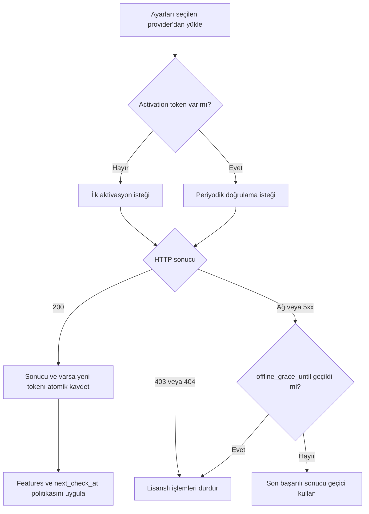

# Lisans API’si Entegrasyon Rehberi

Bu rehber, lisans doğrulama sistemini açık veya kapalı kaynaklı bir uygulamaya
bağlamak isteyen geliştiriciler içindir. Entegrasyon protokolü herhangi bir
framework’e, yönetim paneline, lisans anahtarının saklandığı yere veya kullanıcı
arayüzüne bağlı değildir.

Uygulama lisans anahtarını aşağıdaki kaynakların herhangi birinden alabilir:

- kaynak koduna veya özel build çıktısına gömülen bir değer;
- ortam değişkeni ya da platform secret’ı;
- `.env`, JSON, YAML, INI veya uygulamaya özel bir ayar dosyası;
- veritabanı, key-value store veya secret manager;
- kurulum sihirbazı, CLI argümanı, masaüstü ayarı veya geliştiricinin kendi arayüzü;
- uygulamanın kendi lisans sağlayıcı/adapter fonksiyonu.

API, anahtarın nereden geldiğini bilmez ve belirli bir yöntem zorunlu kılmaz.
Geliştirici; dağıtım modeline, tehdit modeline ve kullanıcı deneyimine uygun
yöntemi seçer.

Makine tarafından okunabilir sözleşme:
[OpenAPI 3.1 tanımı](./openapi-license-v1.yaml)

Üretimde API taban adresi HTTPS olmalıdır. Doğrulama ucu IP başına dakikada 60,
aktivasyon bırakma ucu IP başına dakikada 20 istekle sınırlıdır.

## 1. Temel kavramlar

| Alan | Anlamı |
|---|---|
| `license_key` | Panelde üretilen lisans anahtarı |
| `domain` | Lisansın çalışacağı normalize edilmiş hostname |
| `environment` | `production`, `staging` veya `local` |
| `instance_id` | Kurulum ya da mantıksal instance için kalıcı, benzersiz kimlik |
| `activation_token` | İlk başarılı aktivasyonda üretilen ve sonraki istekleri aynı kuruluma bağlayan sır |
| `features` | Lisansın izin verdiği özellik kodları |

### Domain seçimi

`domain`, lisansın panelde bağlı olduğu domain ile birebir eşleşir. Şema, port,
path, query ve sondaki nokta sunucu tarafından temizlenir; buna rağmen istemcinin
doğrudan hostname göndermesi önerilir.

```text
https://www.example.com/admin?x=1  ->  www.example.com
example.com:443                    ->  example.com
```

`www.example.com` ile `example.com` farklı hostlardır. İkisi de kullanılacaksa
lisansa iki ayrı domain eklenmelidir.

Domain değeri uygulamanın dağıtım yapılandırmasından, gelen isteğin güvenilir host
bilgisinden, site URL ayarından veya geliştiricinin kendi provider fonksiyonundan
üretilebilir. Her doğrulamada son kullanıcının değiştirebildiği kontrolsüz bir form
değerine güvenilmemelidir.

### Instance kimliği

`instance_id` en az 3, en fazla 200 karakterdir ve uygulama yeniden başladığında
değişmemelidir. UUID iyi bir varsayılandır.

- Tek sunucu: ilk kurulumda üretip kalıcı ayar alanına yazın.
- Container: kalıcı volume veya dış secret/config store kullanın.
- Birden fazla replica tek lisans koltuğunu paylaşacaksa aynı mantıksal
  `instance_id` kullanılabilir.
- Her replica ayrı aktivasyon sayılacaksa her birine farklı kimlik verin.

Her açılışta rastgele kimlik üretmek aktivasyon limitini gereksiz yere doldurur.

### Akış özeti



## 2. Lisans anahtarını sağlama

Aşağıdaki örneklerin tamamı aynı API isteğine dönüşür. Sistem bunlardan birini
diğerine tercih etmez.

### Ortam değişkeni

```dotenv
APP_LICENSE_KEY="PT-XXXXX-XXXXX-XXXXX-XXXXX"
```

### Uygulama ayarı

```json
{
  "licensing": {
    "key": "PT-XXXXX-XXXXX-XXXXX-XXXXX",
    "domain": "example.com",
    "environment": "production"
  }
}
```

### Kod veya build sırasında enjeksiyon

```ts
const licenseKey = BUILD_TIME_LICENSE_KEY;
```

Gerçek anahtarı herkese açık bir Git deposuna yazmak anahtarı da herkese açık
hale getirir. Buna rağmen protokol teknik olarak anahtarın koddan gelmesini
engellemez; risk ve dağıtım kararı entegrasyonu yapan geliştiriciye aittir.

En esnek yaklaşım bir provider kullanmaktır:

```ts
type LicenseSettings = {
  key: string;
  domain: string;
  environment: "production" | "staging" | "local";
  instanceId: string;
  appVersion?: string;
};

async function loadLicenseSettings(): Promise<LicenseSettings> {
  // Env, dosya, DB, secret manager, CLI veya kendi arayüzünüzden okuyabilirsiniz.
  return myApplicationLicenseProvider();
}
```

## 3. İlk aktivasyon

İlk istekte `activation_token` gönderilmez:

```bash
curl --request POST 'https://panel.example.com/api/v1/licenses/validate' \
  --header 'Content-Type: application/json' \
  --data '{
    "license_key": "PT-XXXXX-XXXXX-XXXXX-XXXXX",
    "domain": "example.com",
    "environment": "production",
    "instance_id": "3c69e6b7-c27d-49b8-9220-41b0ad60f8a9",
    "app_version": "2.4.0"
  }'
```

Başarılı ilk yanıt:

```json
{
  "valid": true,
  "status": "active",
  "domain": "example.com",
  "environment": "production",
  "instance_id": "3c69e6b7-c27d-49b8-9220-41b0ad60f8a9",
  "product": "Example Product",
  "expires_at": "2027-08-11T20:59:59.999Z",
  "grace_ends_at": "2027-08-25T20:59:59.999Z",
  "in_grace_period": false,
  "features": ["api_access", "multi_user"],
  "checked_at": "2026-08-11T12:00:00.000Z",
  "check_interval_seconds": 600,
  "next_check_at": "2026-08-11T12:10:00.000Z",
  "offline_grace_seconds": 86400,
  "offline_grace_until": "2026-08-12T12:00:00.000Z",
  "activation_token": "PAT-..."
}
```

`activation_token` yalnızca yeni, yeniden etkinleşen veya eski tokensız bir
aktivasyonda döner. İstemci bu değeri kendi kalıcı özel deposuna yazmalıdır.
Depolama biçimi API’nin parçası değildir.

## 4. Sonraki kontroller

Sonraki doğrulamalarda saklanan token eklenir:

```bash
curl --request POST 'https://panel.example.com/api/v1/licenses/validate' \
  --header 'Content-Type: application/json' \
  --data '{
    "license_key": "PT-XXXXX-XXXXX-XXXXX-XXXXX",
    "domain": "example.com",
    "environment": "production",
    "instance_id": "3c69e6b7-c27d-49b8-9220-41b0ad60f8a9",
    "activation_token": "PAT-...",
    "app_version": "2.4.0"
  }'
```

İstemci sabit bir süreyi koda yazmak yerine yanıttaki
`check_interval_seconds`/`next_check_at` değerlerini kullanmalıdır. Mevcut politika
normal durumda 10 dakikada bir kontroldür.

Önerilen durum akışı:

1. Uygulama başlangıcında yerel son başarılı sonucu yükleyin.
2. Zamanı geldiyse lisans API’sine doğrulama isteği gönderin.
3. `200` yanıtında sonucu ve varsa yeni `activation_token` değerini atomik kaydedin.
4. `403` veya `404` yanıtında lisansı hemen geçersiz kabul edin.
5. Ağ/timeout/`5xx` hatasında yalnızca daha önce başarılı bir doğrulama varsa
   `offline_grace_until` anına kadar kontrollü çalışmaya devam edin.
6. `429` yanıtında `Retry-After` başlığına uyun.
7. Çevrimdışı pencere de bittiyse lisans gerektiren işlemleri durdurun veya ürün
   politikanıza uygun salt-okunur moda geçin.

Sunucunun verdiği açık bir ret yanıtı ağ hatası sayılmamalı ve çevrimdışı cache ile
geçersiz kılınmamalıdır.

## 5. Özellik yetkilendirme

`features` dizisi ürün yetkilerini taşır. Yalnızca butonları gizlemek yeterli
değildir; ilgili backend/iş mantığı da özellik kodunu kontrol etmelidir.

```ts
function requireFeature(license: { valid: boolean; features: string[] }, feature: string) {
  if (!license.valid || !license.features.includes(feature)) {
    throw new Error(`Bu lisans ${feature} özelliğini içermiyor.`);
  }
}

requireFeature(currentLicense, "api_access");
```

Bilinmeyen özellik kodları yok sayılmalı; istemci yalnızca tanıdığı kodları
etkinleştirmelidir.

## 6. Aktivasyon bırakma

Uygulama kaldırılırken, başka sunucuya taşınırken veya kullanıcı lisansı bu
kurulumdan kaldırdığında koltuk iade edilebilir:

```bash
curl --request POST 'https://panel.example.com/api/v1/licenses/deactivate' \
  --header 'Content-Type: application/json' \
  --data '{
    "license_key": "PT-XXXXX-XXXXX-XXXXX-XXXXX",
    "instance_id": "3c69e6b7-c27d-49b8-9220-41b0ad60f8a9",
    "activation_token": "PAT-..."
  }'
```

Başarılı yanıt idempotent’tir:

```json
{ "deactivated": true, "released": 1 }
```

`released: 0`, geçerli tokena sahip aktivasyonun zaten pasif olduğunu gösterir ve
başarılı kabul edilebilir. Başarılı bırakmadan sonra yerel activation tokenı
silinmelidir.

## 7. JavaScript / TypeScript örneği

Bu istemci anahtar veya tokenın nerede tutulduğunu varsaymaz; callback’lerle
uygulamaya bırakır.

```ts
type LicenseConfig = {
  baseUrl: string;
  licenseKey: string;
  domain: string;
  environment: "production" | "staging" | "local";
  instanceId: string;
  appVersion?: string;
};

async function validateLicense(
  config: LicenseConfig,
  loadToken: () => Promise<string | null>,
  saveToken: (token: string) => Promise<void>
) {
  const activationToken = await loadToken();
  const response = await fetch(new URL("/api/v1/licenses/validate", config.baseUrl), {
    method: "POST",
    headers: { "Content-Type": "application/json" },
    body: JSON.stringify({
      license_key: config.licenseKey,
      domain: config.domain,
      environment: config.environment,
      instance_id: config.instanceId,
      app_version: config.appVersion,
      ...(activationToken ? { activation_token: activationToken } : {}),
    }),
    signal: AbortSignal.timeout(10_000),
  });

  const result = await response.json();
  if (!response.ok) {
    return { valid: false as const, httpStatus: response.status, ...result };
  }
  if (result.activation_token) await saveToken(result.activation_token);
  return result;
}
```

`loadToken`/`saveToken`; dosya, DB, platform secret’ı, işletim sistemi keychain’i
veya geliştiricinin seçtiği başka bir adapter olabilir.

## 8. PHP örneği

```php
<?php
function validateLicense(array $config, ?string $activationToken): array
{
    $payload = [
        'license_key' => $config['license_key'],
        'domain' => $config['domain'],
        'environment' => $config['environment'] ?? 'production',
        'instance_id' => $config['instance_id'],
    ];
    if (!empty($config['app_version'])) {
        $payload['app_version'] = $config['app_version'];
    }
    if ($activationToken) {
        $payload['activation_token'] = $activationToken;
    }

    $ch = curl_init(rtrim($config['base_url'], '/') . '/api/v1/licenses/validate');
    curl_setopt_array($ch, [
        CURLOPT_POST => true,
        CURLOPT_RETURNTRANSFER => true,
        CURLOPT_CONNECTTIMEOUT => 5,
        CURLOPT_TIMEOUT => 10,
        CURLOPT_HTTPHEADER => ['Content-Type: application/json'],
        CURLOPT_POSTFIELDS => json_encode($payload, JSON_THROW_ON_ERROR),
    ]);

    $body = curl_exec($ch);
    if ($body === false) {
        throw new RuntimeException('Lisans sunucusuna ulaşılamadı: ' . curl_error($ch));
    }
    $status = curl_getinfo($ch, CURLINFO_HTTP_CODE);
    curl_close($ch);

    return [
        'http_status' => $status,
        'body' => json_decode($body, true, 512, JSON_THROW_ON_ERROR),
    ];
}
```

Dönen `activation_token` değerinin nereye yazılacağı çağıran uygulamanın
sorumluluğundadır; fonksiyon bir yönetim paneli veya veritabanı varsaymaz.

## 9. Python örneği

```python
from typing import Any
import requests

def validate_license(
    config: dict[str, Any], activation_token: str | None = None
) -> tuple[int, dict[str, Any]]:
    payload = {
        "license_key": config["license_key"],
        "domain": config["domain"],
        "environment": config.get("environment", "production"),
        "instance_id": config["instance_id"],
    }
    if config.get("app_version"):
        payload["app_version"] = config["app_version"]
    if activation_token:
        payload["activation_token"] = activation_token

    response = requests.post(
        f"{config['base_url'].rstrip('/')}/api/v1/licenses/validate",
        json=payload,
        timeout=(5, 10),
    )
    return response.status_code, response.json()
```

## 10. Tarayıcı, masaüstü, CLI ve eklenti kullanımı

API düz HTTP/JSON kullandığı için backend, worker, cron, CLI, masaüstü uygulaması,
CMS eklentisi veya framework modülünden çağrılabilir.

Tarayıcıdan doğrudan çağrı aynı-origin bir proxy veya uygun CORS yapılandırmasıyla
teknik olarak mümkündür; fakat lisans anahtarı ve activation tokenı kullanıcıya
görünür olur. Açık kaynaklı bir frontend’de bu değerler sır kabul edilmemelidir.
Güçlü uygulama zorlaması gerekiyorsa doğrulama ve özellik kontrolü backend’de ya da
sağlayıcının kontrol ettiği uzak bir serviste yapılmalıdır.

CLI/masaüstü uygulamalarında token; işletim sistemi keychain’i, kullanıcı config
dizini veya uygulamanın kendi güvenli depolama adapterında tutulabilir. API bunlardan
birini zorunlu kılmaz.

## 11. Hata kodları

| HTTP | `error` | İstemci davranışı |
|---:|---|---|
| 403 | `domain_mismatch` | Gönderilen domain/ortam lisansa bağlı değil; çalışmayı durdurun |
| 403 | `activation_domain_mismatch` | Aynı aktivasyon başka domain kaydına taşınmaya çalışılıyor |
| 403 | `activation_token_required` | Aktif kurulumun saklanan tokenı eksik |
| 403 | `invalid_activation_token` | Token uyuşmuyor; otomatik token silip tekrar aktivasyon denemeyin |
| 403 | `activation_limit_exceeded` | Lisansın aktif koltuk limiti dolu |
| 403 | `pending` | Lisans henüz aktifleştirilmemiş |
| 403 | `not_started` | Başlangıç tarihi gelmemiş |
| 403 | `expired` | Süre ve ek süre bitmiş |
| 403 | `suspended` | Lisans askıda |
| 403 | `revoked` | Lisans iptal edilmiş |
| 404 | `not_found` | Anahtar bulunamadı |
| 413 | `body_too_large` | İstek gövdesini küçültün |
| 422 | `invalid_body` | Alanları ve tipleri düzeltin |
| 422 | `invalid_key_format` | Anahtar biçimini düzeltin |
| 422 | `invalid_domain` | Geçerli bir hostname gönderin |
| 429 | `rate_limited` | `Retry-After` süresini bekleyin |
| 500 | `server_error` | Geçici hata politikası/çevrimdışı pencereyi uygulayın |

Güvenlik nedeniyle API, bazı ret yanıtlarında lisansa ait ek ayrıntı vermez.

## 12. Açık kaynak ve güven sınırı

Lisans kontrol kodu son kullanıcının tamamen kontrol ettiği bir makinede ve açık
kaynak olarak çalışıyorsa kullanıcı bu kontrolü değiştirebilir. Hiçbir uzaktan
lisans API’si, istemci çalışma zamanını mutlak biçimde kurcalamaya dayanıklı yapamaz.

Koruma seviyesini artırmak için:

- anahtarı ve activation tokenı Git deposuna yazmayın;
- kontrolleri yalnız frontend görünürlüğünde değil backend iş kurallarında uygulayın;
- `instance_id` ve tokenı kalıcı ve kullanıcıdan mümkün olduğunca ayrı tutun;
- lisans gerektiren kritik veri veya hizmeti mümkünse sağlayıcının kontrol ettiği
  bir API arkasında tutun;
- explicit `403/404` yanıtlarını çevrimdışı cache ile geçersiz kılmayın;
- uygulama ve bağımlılık güncellemelerinde hata kodlarını fail-closed ele alın.

Bu sınırlama entegrasyon yöntemini yasaklamaz; geliştiricinin doğru tehdit modeliyle
karar vermesini sağlar.

## 13. Sürümleme ve uyumluluk

Bu sözleşmenin yolu `/api/v1` ile başlar. İstemci:

- tanımadığı JSON alanlarını yok saymalı;
- tanımadığı `features` kodlarını etkinleştirmemeli;
- `check_interval_seconds` değerini sabit varsaymamalı;
- yeni hata kodlarında güvenli varsayılan olarak lisanslı işlemi reddetmeli;
- timeout belirlemeli ve sınırsız, sık retry döngüsü oluşturmamalıdır.

Bu kurallar v1 sözleşmesine geriye uyumlu alan eklenmesini kolaylaştırır.
